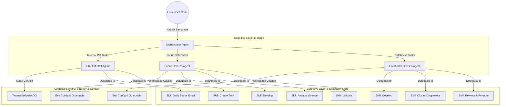

# Agentic Workflow Architecture & Velocity Pitch

This document outlines our new **Agentic Workflow Architecture** driven by GitHub Copilot in VS Code. It serves as a blueprint for transitioning from traditional, browser-heavy data ops and project management to a streamlined, AI-integrated model.

## 1. The Architecture Pattern: "Chief of Staff & Specialists"

We have structured our agents to mirror a high-performing team hierarchy, reducing cognitive load and ensuring specialized execution.

### High-Level Design
The system operates in three cognitive layers:

1.  **Orchestrator (Triage):**  It acts as the "Front Desk". It does not execute tasks but routes them to the right "department".
2.  **Domain Specialists (Strategy):** Agents like `fabric-devops` or `databricks-devops`. They own the "World View" (configurations, environments, guardrails) and plan the execution.
3.  **Skills (Execution):** The functional units that perform specific tasks (e.g., "Analyze Lineage", "Deploy Notebook") following strict Standard Operating Procedures (SOPs).

### Architecture Diagram

---

## 2. Comparison: Traditional Web Browser Workflow vs. Agentic Workflow

Why transition? The Agentic model solves the "Context Switching Tax" and "Safety Risks" inherent in manual browser operations.

| Feature | Traditional PM/Dev Web Browser Workflow | Agentic VS Code Workflow |
| :--- | :--- | :--- |
| **Interface** | **Fragmented:** Multiple tabs open for Azure Portal, Fabric, DevOps, Teams, Outlook, Excel. | **Unified:** Single chat interface in VS Code. All tools (coding, planning, execution) in one place. |
| **Context Switching** | **High Cost:** Alt-Tab between a requirement in Email and the execution in Azure. Context is lost in transit. | **Zero Cost:** The agent reads the email *and* executes the Azure command in the same continuous thread. |
| **Information Retrieval** | **Manual Hunting:** "Where is that Workspace ID?" "What is the URL for UAT?" Searching through bookmarks or OneNote. | **Automated Lookup:** Agents resolve "UAT" to the correct GUID automatically using the `workspace-catalog.yaml`. |
| **Safety & Risk** | **Human Error:** Risk of accidentally clicking "Delete" on PROD instead of DEV. UI buttons look the same. | **Systematic Guardrails:** Agents enforce "Read-Only" defaults on PROD. Governance is code, not just policy. |
| **Execution** | **Click-Heavy:** Navigating menus, waiting for page loads, clicking buttons. | **Intent-Based:** "Deploy to UAT and validate." The agent handles the 50 steps required to do that. |
| **Reproducibility** | **Low:** Hard to document exactly what was clicked. "Tribal knowledge" of UI paths. | **High:** Every action is a chat log. Prompts and Skills are version-controlled code. |

## 3. The Velocity Pitch: Why Change?

### 🚀 Speed through Synthesis
Instead of spending 30 minutes gathering context from an email, finding the right Azure resource, and opening the right board in ADO, you can issue a single compound command:
> *"Review the email from Sarah about the 'Partner Churn' metric, create a task in ADO to track it, and check if that metric exists in the UAT Semantic Model."*

### 🛡️ Safety through Guardrails
The agent is configured to **deny** dangerous operations on Production unless explicitly confirmed. It allows junior members to operate with the safety net of a senior engineer's codified knowledge.

### 🧠 Reduced Cognitive Load
You no longer need to memorize GUIDs, specific URL paths, or complex CLI syntax. You focus on the **Business Intent**, and the Agent handles the **Technical Implementation Details**.

---

## Deep Dives

For a full exploration of these concepts, see:

1. [Why Agentic — Motivation & Vision](Why-Agentic-Motivation-and-Vision.md) — The "why" behind the shift: cognitive effort, dependencies, delegation, and velocity
2. [Architecture & Design Thinking](Architecture-and-Design-Thinking.md) — How agents, skills, configs, and MCP servers are designed and why
3. [Use Cases & ROI](Use-Cases-and-ROI.md) — Concrete workflows with before/after comparisons and aggregate time savings
