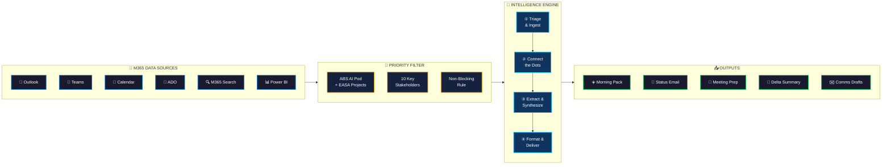
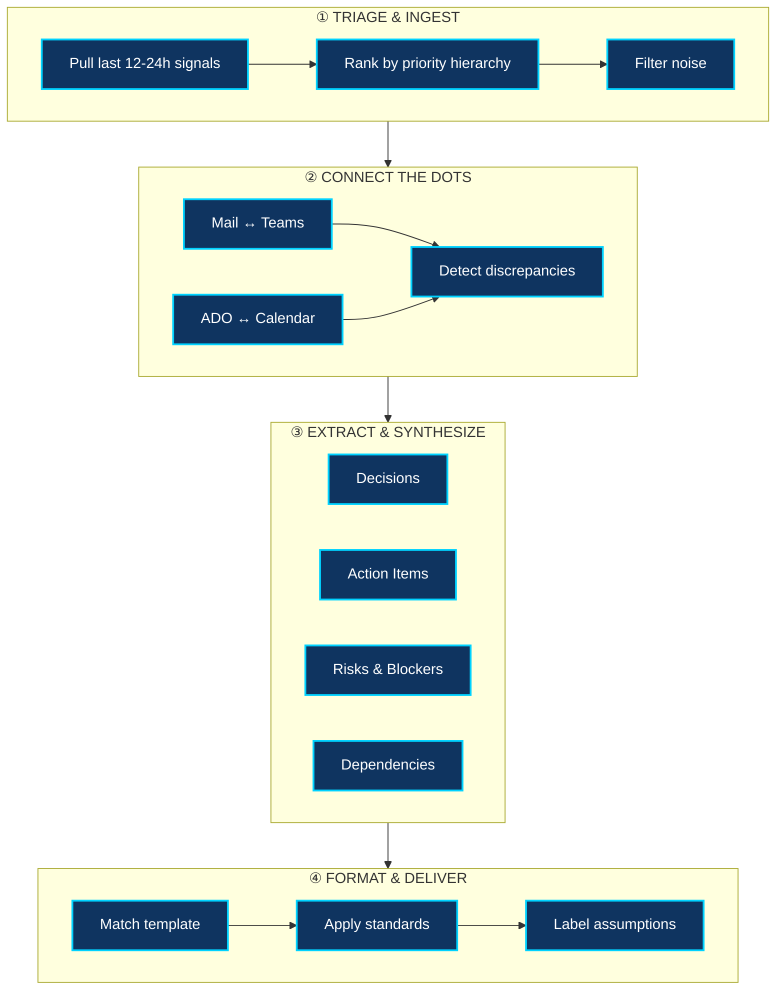
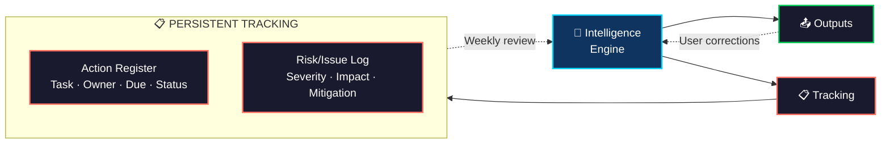

# Chief of Staff 2.0 — Agent Architecture

## System Overview

## Detailed Intelligence Pipeline

## Tracking & Feedback Loop

---

## Architecture Summary

| Layer | Role | Key Behavior |
|-------|------|-------------|
| **Data Sources** | Raw signal ingestion from 6 M365 tool categories | Mail, Teams, Calendar, ADO, M365 Search, Power BI |
| **Priority Filter** | Focus lens — only high-value signals pass | 2 projects + 10 stakeholders + non-blocking rule |
| **Intelligence Engine** | 4-stage pipeline: Triage → Connect → Extract → Format | Cross-references sources, detects discrepancies, evidence-links claims |
| **Outputs** | Ready-to-use deliverables | Morning Pack, Status Mail, Meeting Prep/MoM, Delta Summaries, Drafts |
| **Tracking** | Persistent registers for actions & risks | Action Register + Risk/Issue Log with weekly review loop |

### Data Flow

1. **Ingest** — Tools pull last 12-24h signals from Outlook, Teams, Calendar, ADO, M365 Search, Power BI
2. **Filter** — Priority hierarchy: key chats → project channels → ADO items → stakeholder emails
3. **Connect** — Cross-reference engine links mail ↔ Teams ↔ ADO ↔ meeting outcomes
4. **Extract** — Decisions, action items, risks, dependencies pulled with evidence citations
5. **Format** — Output shaped to template (status mail, morning pack, MoM, etc.)
6. **Deliver** — Copy-paste-ready output; feedback loop refines next iteration
